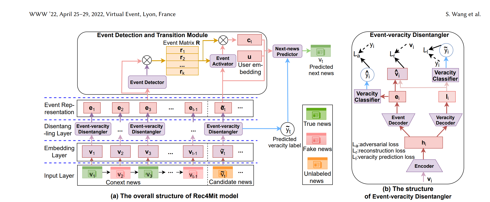

<h1 align="center">Rec4Mit</h1>

가짜뉴스 확산을 완화하는 뉴스 추천 모델 <b>PyTorch</b> 구현.

Rec4Mit은 사용자의 최근 뉴스 열람 이력을 보고 <b>다음에 읽을 뉴스를 추천</b>합니다. 
뉴스 벡터를 <b>사건(event) 표현</b>과 <b>진위(veracity) 표현</b>으로 분리한 뒤, 
사건 흐름을 따라가며 <b>진짜 뉴스만</b> 추천 목록에 올립니다.

<h2 align="center" id="quick-start">빠른 시작</h2>

<h3>1. 설치</h3>

<pre><code>pip install -r requirements.txt</code></pre>

<h3>2. 데이터 준비</h3>

저장소에 포함된 <code>news.zip</code>을 같은 자리에 풉니다.

<pre><code>DataPreperation/datas/news/gossip.csv
DataPreperation/datas/news/pol.csv</code></pre>

그다음 전처리 파이프라인을 실행합니다.

<pre><code>python DataPreperation/dataPipeline.py</code></pre>

<h3>3. 학습</h3>

<pre><code>python train.py --data pol --fold_num 1        # politifact fold 1개만 학습
python train.py --data gossip --fold_num 10    # gossipcop fold 10개 모두 학습</code></pre>

<h3>4. 평가</h3>

<pre><code>python test.py --data pol
python test.py --data gossip --batch 32        # --batch 기본값 32</code></pre>

<h2 align="center" id="structure">폴더 구조</h2>

<pre><code>REC4MIT/
├── rec4mit.py                    # 레이어 1~3을 합친 Rec4Mit 모델
├── requirements.txt              # 의존 패키지
├── train.py                      # 학습
├── test.py                       # 평가
│
├── Model/
│   ├── layer1.py                 # 논문의 임베딩 층
│   ├── layer2.py                 # 분리층
│   └── layer3.py                 # 사건감지, 예측 층
│
├── DataPreperation/
│   ├── dataPipeline.py           # 전처리
│   └── datas/
│       ├── news.zip              # 이 위치에서 해제
│       ├── news/                 # 해제 시 생길 폴더
│       ├── user_interaction/     # 유저 - [뉴스1, 뉴스2, ...] 식으로 재구성
│       ├── folds/{data}/{0~9}/   # train / val / test 인스턴스 (10개의 fold)
│       └── emb/                  # 뉴스 임베딩 (제목 + 설명)
│
└── model_dir/{data}/fold_{n}.pth # 학습 가중치 저장소</code></pre>

<h2 align="center" id="dataset">데이터셋</h2>

<table align="center">
  <tr>
    <th>항목</th>
    <th>PolitiFact (<code>pol</code>)</th>
    <th>GossipCop (<code>gossip</code>)</th>
  </tr>
  <tr><td>뉴스 수</td><td align="right">599</td><td align="right">17,527</td></tr>
  <tr><td>진짜 / 가짜</td><td align="right">280 / 319</td><td align="right">13,120 / 4,407</td></tr>
  <tr><td>사용자 수</td><td align="right">162,262</td><td align="right">251,681</td></tr>
  <tr><td>열람 기록 수</td><td align="right">256,380</td><td align="right">1,106,623</td></tr>
  <tr><td>학습 인스턴스</td><td align="right">47,464</td><td align="right">136,004</td></tr>
</table>

<h3 align="center">뉴스 속성</h3>

<table align="center">
  <tr><th>컬럼</th><th>설명</th></tr>
  <tr><td><code>news_id</code></td><td>뉴스 고유 ID</td></tr>
  <tr><td><code>title</code></td><td>제목</td></tr>
  <tr><td><code>description</code></td><td>본문 요약</td></tr>
  <tr><td><code>label</code></td><td><code>0</code> = 진짜, <code>1</code> = 가짜</td></tr>
  <tr><td><code>user_ids</code></td><td>이 뉴스를 공유한 사용자 ID 리스트</td></tr>
  <tr><td><code>user_times</code></td><td>각 사용자의 공유 시각 리스트</td></tr>
</table>

<h2 align="center" id="model">모델</h2>

<pre><code>뉴스 ID ──► [Layer 1] 임베딩 ──► [Layer 2] 인코더 ──┬─► 사건 표현 e (128)
                                                    └─► 진위 표현 l (128) ─► 가짜 확률

컨텍스트 e ──► [Layer 3] 사건 감지 ─► 사건 전이 R ─► 사용자 결합 c_u ─► 후보 점수</code></pre>

<b>Layer 1 · 임베딩 (<code>Model/layer1.py</code>)</b>

 
<table>
  <tr><th>구성</th><th>설명</th></tr>
  <tr><td><code>init_emb</code></td><td>제목·본문 임베딩을 이어 붙여 <code>(N+1, 1536)</code> 행렬 생성. 0번 행은 패딩</td></tr>
  <tr><td><code>EmbeddingLayer</code></td><td>학습 가능한 ID 임베딩(128) + BERT 메타 임베딩(1536) → 뉴스 벡터 <code>v</code> (256)</td></tr>
</table>

<b>Layer 2 · 분리 (<code>Model/layer2.py</code>)</b>

 
<table>
  <tr><th>구성</th><th>입력 → 출력</th><th>설명</th></tr>
  <tr><td><code>Encoder</code></td><td>256 → 256</td><td>3단 Dense + skip-connection, LeakyReLU(0.1)</td></tr>
  <tr><td><code>EventDecoder</code></td><td>256 → 128</td><td>사건 표현 <code>e</code></td></tr>
  <tr><td><code>VeracityDecoder</code></td><td>256 → 128 + 로짓</td><td>진위 표현 <code>l</code>과 가짜 여부 로짓 (Eq 8)</td></tr>
  <tr><td><code>DisentangleLoss</code></td><td></td><td>아래 세 손실 계산</td></tr>
</table>

<b>Layer 3 · 사건 전이와 추천 (<code>Model/layer3.py</code>)</b>

 
<table>
  <tr><th>구성</th><th>설명</th></tr>
  <tr><td><code>EventDetector</code></td><td><code>e</code>를 K=20개 잠재 사건으로 소프트 분배 (Eq 13~14)</td></tr>
  <tr><td><code>EventTransitionNet.build_R</code></td><td>위치 임베딩 + attention으로 컨텍스트를 요약해 사건 전이 행렬 <code>R</code> 생성 (Eq 15~16)</td></tr>
  <tr><td><code>EventTransitionNet.activate</code></td><td>후보와 <code>R</code> 사이 attention → 문맥 벡터 → 사용자 임베딩과 결합해 <code>c_u</code> (Eq 17~19)</td></tr>
  <tr><td><code>NextNewsPredictor</code></td><td>점수 = <code>c_u · e_t</code> (Eq 20)</td></tr>
</table>

<h3 align="center">손실</h3>

<table align="center">
  <tr><th>손실</th><th>식</th><th>의미</th></tr>
  <tr><td><code>L_r</code></td><td>½‖[e ; l] − v‖²</td><td>두 표현을 합치면 원래 벡터가 복원돼야 함 (Eq 9)</td></tr>
  <tr><td><code>L_l</code></td><td>BCE(로짓, y)</td><td>진위 표현으로 가짜 여부를 맞춰야 함 (Eq 10)</td></tr>
  <tr><td><code>L_a</code></td><td>1 / BCE(Dense(e), y)</td><td>사건 표현으로는 진위를 <b>못 맞춰야</b> 함 (Eq 11)</td></tr>
</table>

> [!IMPORTANT]
> 현재 코드는 `L_l`만 최종 손실에 포함합니다. `L_a`가 오히려 모델 점수를 많이 낮춰서 뺐습니다.
>
> 학습 후보는 정답 1개 + 네거티브 64개 (진짜 32 + 가짜 32) 입니다. 논문은 네거티브 4개 (진짜 2 + 가짜 2) 라 차이가 있습니다.
> 논문보다 뉴스를 많이 사용해서 정답 맞추기가 더 어렵기 때문에 네거티브 개수를 높였습니다.

<h3 align="center">하이퍼파라미터 (<code>Rec4Mit</code> 기본값)</h3>

<table align="center">
  <tr><th>인자</th><th>값</th><th>의미</th></tr>
  <tr><td><code>k</code></td><td align="right">20</td><td>잠재 사건 개수</td></tr>
  <tr><td><code>ctx_len</code></td><td align="right">4</td><td>컨텍스트 길이</td></tr>
  <tr><td><code>v_dim</code></td><td align="right">256</td><td>뉴스 벡터 차원</td></tr>
  <tr><td><code>e_dim</code></td><td align="right">128</td><td>사건 / 진위 표현 차원</td></tr>
  <tr><td><code>user_dim</code></td><td align="right">128</td><td>사용자 임베딩 차원</td></tr>
</table>

<h2 align="center">평가 지표</h2>

<table align="center">
  <tr><th>지표</th><th>의미</th></tr>
  <tr><td><code>REC@K</code></td><td>정답이 top-K 안에 있으면 1</td></tr>
  <tr><td><code>MRR@K</code></td><td>정답 순위의 역수</td></tr>
  <tr><td><code>NDCG@K</code></td><td>1 / log₂(순위 + 1)</td></tr>
  <tr><td><code>RT@K</code></td><td>top-K 중 <b>진짜 뉴스 비율</b></td></tr>
</table>

K = 5, 10, 20 에 대해 계산하고 fold 평균 ± 표준편차를 출력합니다.

